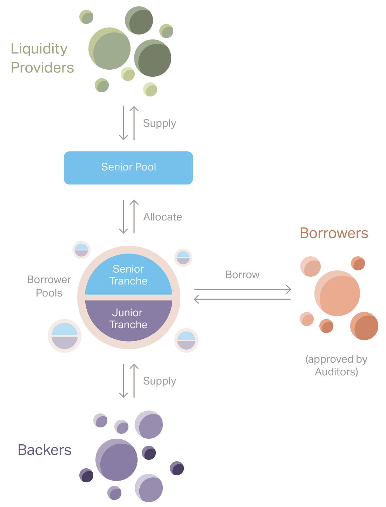

# Overview

## How the protocol works 

The protocol works by extending credit lines to lending businesses. These businesses use their credit lines to draw down stablecoins from the pool (USDC), and then they exchange it for fiat and deploy it on the ground in their local markets. In this way, the protocol provides the utility of crypto — specifically, its global access to capital — while leaving the actual loan origination and servicing to the businesses best equipped to handle it.

On the capital provider side, crypto holders can supply into different pools to earn yield. As the lending businesses make their interest payments back to the protocol, they’re immediately disbursed to all capital providers.

## Participants


The Goldfinch protocol has four core participants: Borrowers, Backers, Liquidity Providers, and Auditors.


**Borrowers** are participants who seek financing, and they propose Borrower Pools for the Backers to assess. Borrower Pools contain the terms a Borrower seeks, like the interest rate and repayment schedule.

**Backers** assess the Borrower Pools and decide whether to supply first-loss capital. After Backers supply capital, Borrowers can borrow and repay through the Borrower Pool.

**Liquidity Providers** supply capital to the Senior Pool in order to earn passive yield. The Senior Pool uses the Leverage Model to automatically allocate capital to the Borrower Pools, based on how many Backers are participating in them. When the Senior Pool allocates capital, a portion of its interest is reallocated to the Backers. This increases the Backers’ effective yield, which incentives them to both provide the higher-risk first-loss capital and do the work of assessing Borrower Pools.

Lastly, **Auditors** vote to approve Borrowers, which is required before they can borrow. Auditors are randomly selected by the protocol, and they provide a human-level check to guard against fraudulent activity.

## Architecture Diagram

